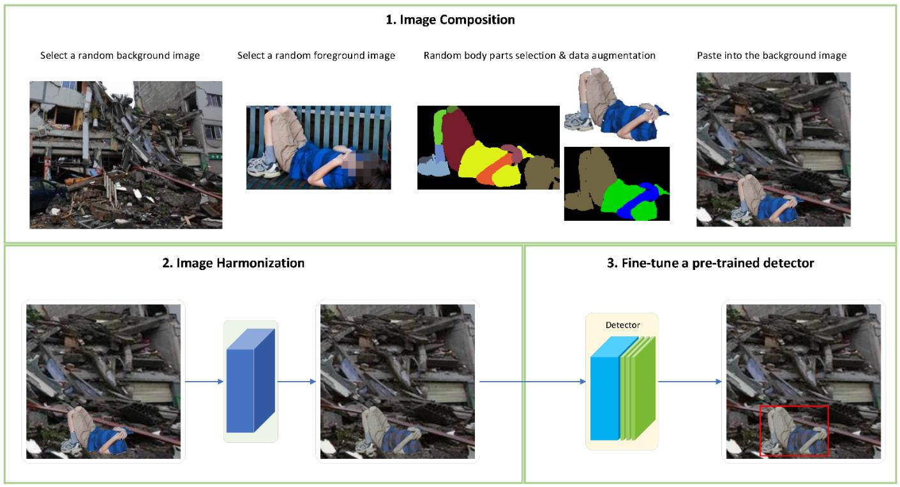

# Training a Disaster Victim Detection Network for UAV Search and Rescue Using Harmonious Composite Images

## Authors
  Ning Zhang, Francesco Nex, Norman Kerle, George Vosselman
  
# Introduction
This repository contains the dataset and source code of our victim detection paper.

# Dataset
We provide the harmonized composite victim images generated by our unsupervised harmonization network (train.py). You can use them to fine-tune your own victim detector.

Harmonized composite images: https://surfdrive.surf.nl/files/index.php/s/yPtgoTrB4CohOL0

# Fine-tune a yolov5 detector
To fine-tune your yolov5 detector you need to put the configuration file (./yolov5/victimdet.yaml) to your own yolov5 dataset path.

# Citation
If you use our code or dataset please cite our papers:
	
	@article{zhang2022training,
    title={Training a Disaster Victim Detection Network for UAV Search and Rescue Using Harmonious Composite Images},
    author={Zhang, Ning and Nex, Francesco and Vosselman, George and Kerle, Norman},
    journal={Remote Sensing},
    volume={14},
    number={13},
    pages={2977},
    year={2022},
    publisher={Multidisciplinary Digital Publishing Institute}
    }
    
	
	@article{zhang2022unsupervised,
    title={Unsupervised harmonious image composition for disaster victim detection},
    author={Zhang, Ning and Nex, F and Vosselman, G and Kerle, N},
    journal={The International Archives of Photogrammetry, Remote Sensing and Spatial Information Sciences},
    volume={43},
    pages={1189--1196},
    year={2022},
    publisher={Copernicus GmbH}
    }